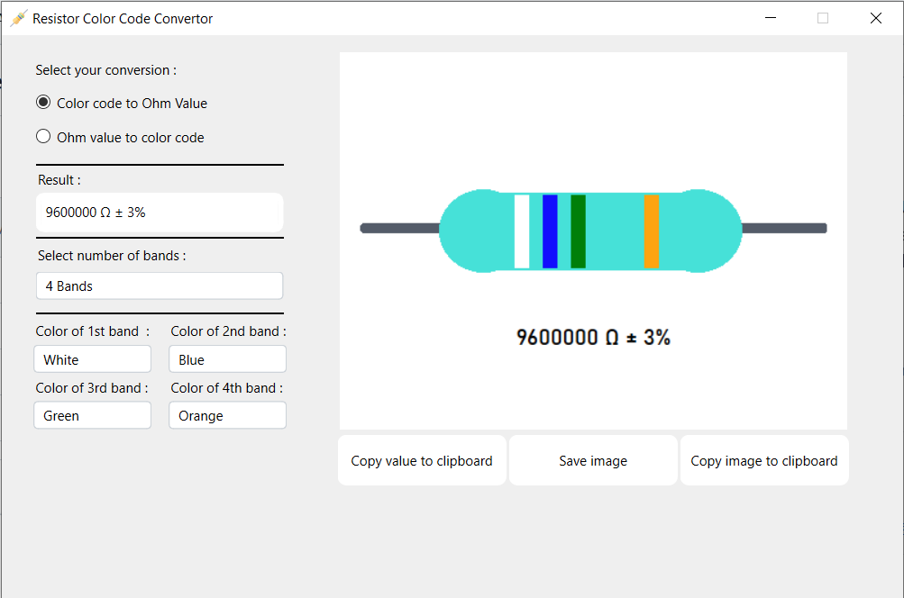
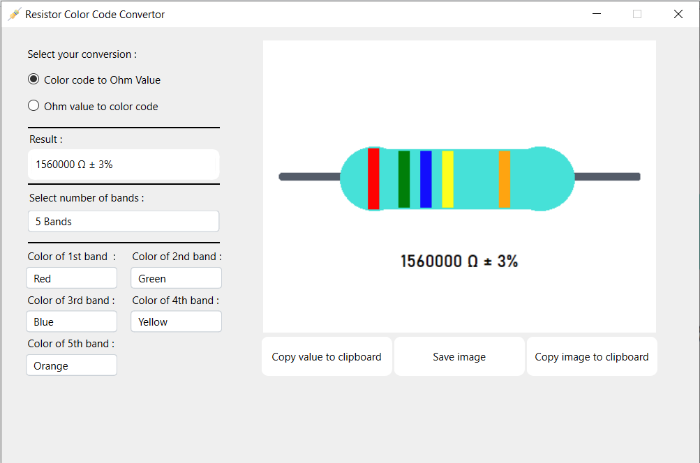
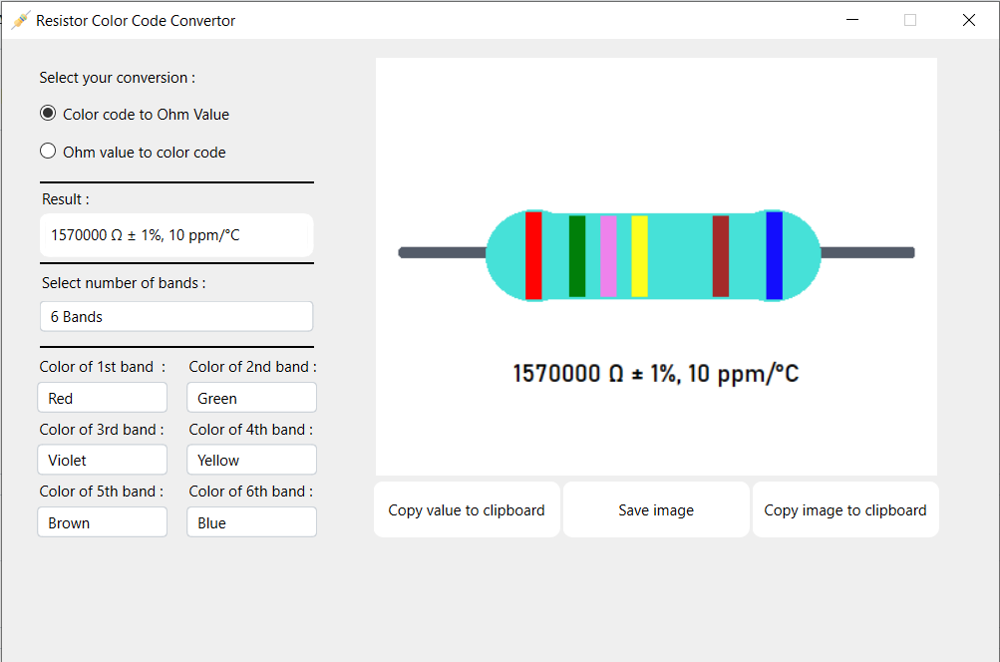
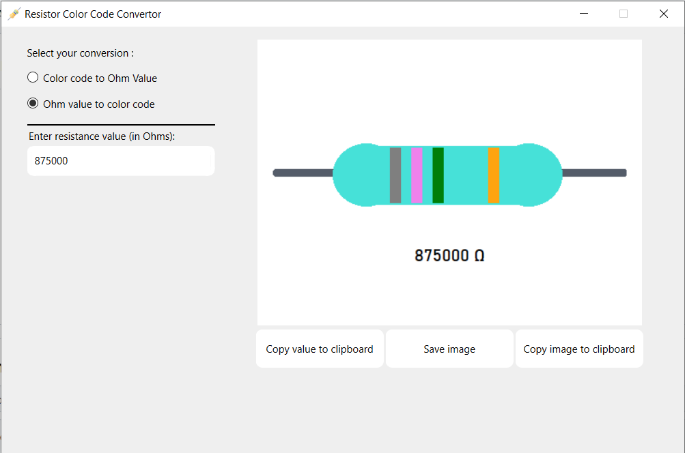

# Resistor Color Code Convertor (Or *RCCC* for short)

A simple GUI Application for converting color codes to Ohm value and vice versa built with Python & PySide6  

# Features
- Converting 4 Band, 5 Band and 6 Band resistors to Ohm Value with instance result
- Copy and save resistor image in different formats
- Convert Ohm value to color bands

# Dependencies
- PySide6 `pip install PySide6`
- re (Regular Expression)

# Screenshots

| 4 Bands | 5 Bands |
|:-------:|:-------:|
|||
| **6 Bands** | **Ohm to color code** |
|||
